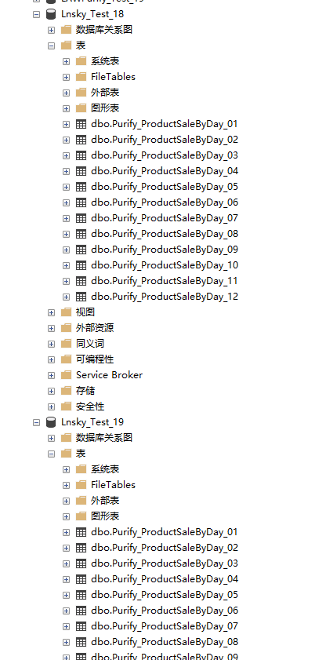
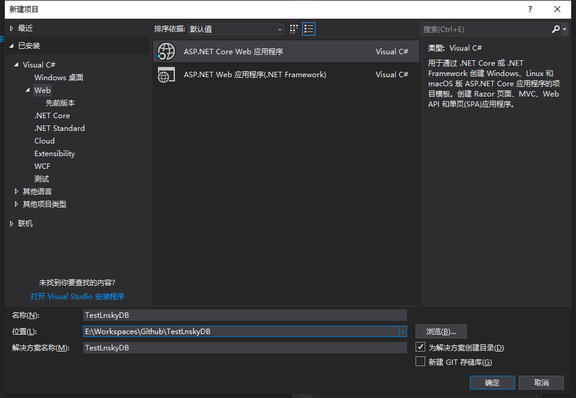
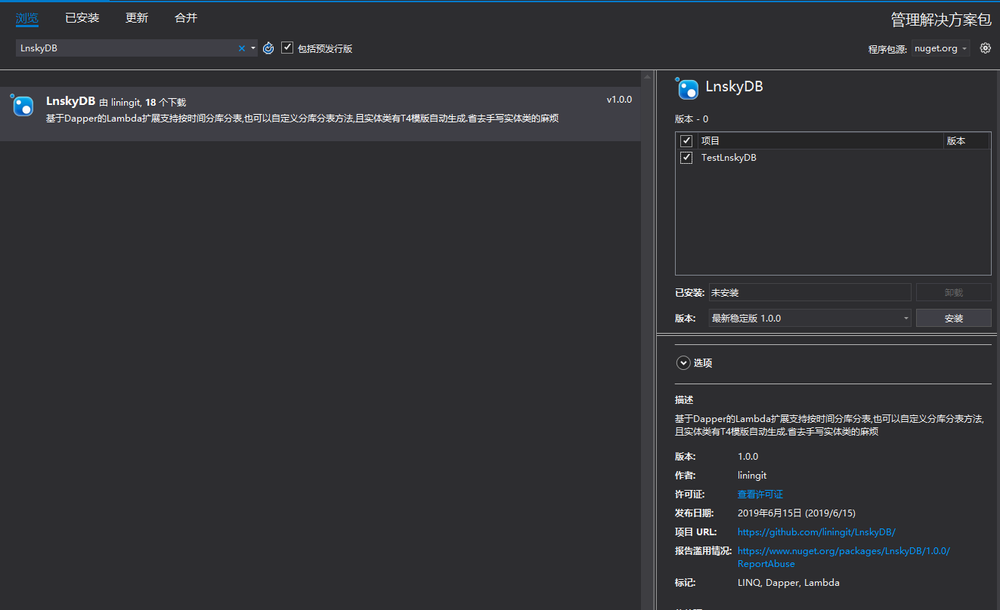

# 快速开始

## 环境准备
1. 开发环境:VS2017+.NET Core 2.2及其以上版本

1. 支持数据库SQL SERVER 2012

1. NuGet地址:[https://www.nuget.org/packages/LnskyDB/](https://www.nuget.org/packages/LnskyDB/ "https://www.nuget.org/packages/LnskyDB/")

## 创建数据库
创建LnskyNS_Test,Lnsky_Test_18,Lnsky_Test_19.三个数据库,其中创建LnskyNS_Test为不分库分表的数据库,另外两个是分库分表的.然后执行 [/src/LnskyDB.Demo/db.sql](https://github.com/liningit/LnskyDB/blob/master/src/LnskyDB.Demo/db.sql "/src/LnskyDB.Demo/db.sql")



## 创建网站
创建.Net core网站TestLnskyDB.


## 配置网站
1. 打开Nuget管理添加LnskyDB包


1. 打开appsettings.json文件加入代码,注意数据库名称为`Lnsky_Test{0}`
```json
"ConnectionStrings": {
    "Lnsky": "Data Source=127.0.0.1;Initial Catalog=Lnsky_Test{0};uid=sa;pwd=123"
}
```
1. 在Startup.cs的`ConfigureServices`中添加`services.AddLnskyDB();`在`Configure`中添加`app.UseLnskyDB();`
```csharp

        public void ConfigureServices(IServiceCollection services)
        {
         
            services.AddMvc().SetCompatibilityVersion(CompatibilityVersion.Version_2_2);
            services.AddLnskyDB();
        }

        // This method gets called by the runtime. Use this method to configure the HTTP request pipeline.
        public void Configure(IApplicationBuilder app, IHostingEnvironment env)
        {
            if (env.IsDevelopment())
            {
                app.UseDeveloperExceptionPage();
            }
            app.UseLnskyDB();
            app.UseMvc();
        }   
```
然后就可以使用了